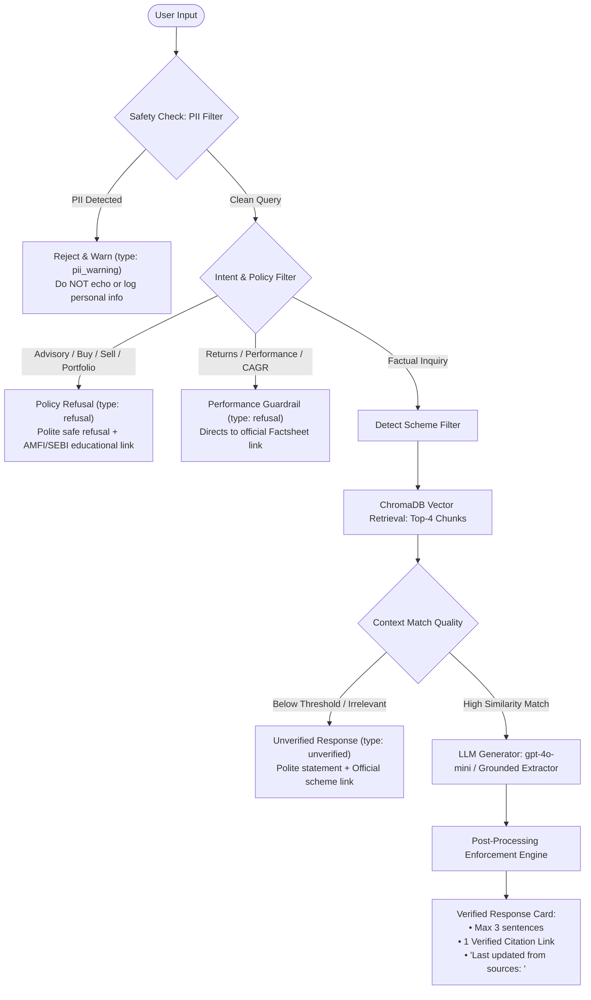

# Facts-Only Mutual Fund Assistant (Groww / HDFC Mutual Fund)

[](https://www.python.org/)
[](https://fastapi.tiangolo.com/)
[](https://www.trychroma.com/)
[](https://react.dev/)
[](https://tailwindcss.com/)
[](https://opensource.org/licenses/MIT)

**Facts-Only Mutual Fund Assistant** is a production-grade, citation-backed RAG (Retrieval-Augmented Generation) application built for the **NextLeap Fellowship Milestone 4 (AI System Design, LLMs & Prompt Engineering)**.

It answers factual queries about mutual fund schemes using **strictly official, public sources** from **HDFC Mutual Fund (`hdfcfund.com`)**, **SEBI (`sebi.gov.in`)**, and **AMFI (`amfiindia.com`)**. It provides verified, concise responses ($\le 3$ sentences), includes a single verified official citation link, and enforces strict guardrails prohibiting any investment advice, return predictions, performance comparisons, or personal identifiable information (PII).

---

## 1. Problem Statement & User Archetype

Retail investors comparing mutual fund schemes often struggle to locate verified factual specifications—such as expense ratios, exit loads, minimum SIP amounts, statutory lock-in periods, riskometer classifications, and consolidated account statement procedures—amidst an internet saturated with sponsored opinions, third-party blogs, and subjective "best fund" lists.

### Context Product: **Groww**
- **User Archetype:** First-time and retail mutual fund investors navigating scheme facts, as well as customer operations and support teams handling repetitive factual inquiries.
- **Solution:** A factual Q&A assistant that acts solely as an objective information retrieval system—guaranteeing zero hallucination, zero investment advice, zero return speculation, and strict privacy protection.

---

## 2. AMC & Verified Scheme Scope

### Asset Management Company: **HDFC Mutual Fund** (`hdfcfund.com`)

| Scheme Name | Category | Primary Focus & Statutory Notes |
|:---|:---|:---|
| **HDFC Flexi Cap Fund** | Equity: Flexi Cap | Dynamic allocation across large, mid, and small-cap stocks. |
| **HDFC Large Cap Fund** *(formerly HDFC Top 100 Fund)* | Equity: Large Cap | **Important:** Formerly known as *HDFC Top 100 Fund*, officially renamed to *HDFC Large Cap Fund* effective January 1, 2025 via formal Addendum dated Dec 24, 2024. |
| **HDFC ELSS Tax Saver** | Equity Linked Savings (ELSS) | 3-year statutory lock-in period from allotment; tax deduction eligibility under Section 80C. |
| **HDFC Mid-Cap Opportunities Fund** | Equity: Mid Cap | Focused allocation to mid-cap companies. |

---

## 3. Allowed Sources & Corpus Curation

To guarantee regulatory accuracy and zero third-party bias, **only official public sources** were ingested. Third-party aggregators, YouTube, Reddit, Quora, and fintech blogs were strictly excluded.

- **Total Verified Sources:** 24 documents (100% reachable with HTTP 200)
- **Document Breakdown:**
  - **HDFC AMC Official Documents (12):** Scheme Information Documents (SID), Key Information Memorandums (KIM), Name Change Addendum, Systematic Investment Plan (SIP) Operations Addendum, Tax Reckoner Guide, and Monthly Factsheet Disclosures.
  - **SEBI Official Documents (3):** SEBI FAQs for Mutual Fund Investors, SEBI FAQs for Intermediaries, and SEBI Master Grievance Portal.
  - **AMFI Official Knowledge Base (9):** Total Expense Ratio (TER) guide, Scheme Types, Scheme Categorization, Tax Regime, Net Asset Value (NAV) Determination, Cut-Off Timings, and Investment Advantages.

The full URL registry is cataloged in [`sources.csv`](./sources.csv).

---

## 4. System Architecture



---

## 5. Key Guardrails & Safety Policies

| Safety Domain | Implementation Strategy | System Response Behavior |
|:---|:---|:---|
| **Personal Information (PII)** | Regex detection for PAN (`[A-Z]{5}[0-9]{4}[A-Z]`), Aadhaar (12 digits), phone numbers (+91), email addresses, OTP patterns, passwords. | Returns `pii_warning`. User message is **never logged or stored**. |
| **Investment Advice** | Pattern match on `"should I buy/sell"`, `"best fund"`, `"safest"`, `"recommend"`, `"portfolio review"`. | Returns polite refusal: *"I can provide factual information about the scheme, but I cannot provide investment advice..."* + official AMFI education URL. |
| **Return Speculation** | Intercepts CAGR calculations, return predictions, and performance comparisons. | Explicit refusal directing user to the official factsheet disclosure link. |
| **Hallucination Prevention** | Chunks are retrieved from ChromaDB; if context is missing or irrelevant, system admits non-verification. | Returns `unverified`: *"I couldn't verify this fact from the official sources available in my knowledge base."* |
| **Answer Brevity** | Programmatic truncation strictly in Python code. | Enforces maximum of $\le 3$ sentences per response. |

---

## 6. Tech Stack

- **Backend:** Python 3.11+, FastAPI, Pydantic v2, Uvicorn
- **Vector Database & RAG:** ChromaDB (persistent local storage), LangChain Text Splitters (`RecursiveCharacterTextSplitter`)
- **Embeddings:** OpenAI `text-embedding-3-small` (with local deterministic fallback for testing)
- **LLM:** OpenAI `gpt-4o-mini` (temperature 0, configurable via `.env`)
- **Extraction:** `requests` + `BeautifulSoup4` (HTML), `pypdf` (PDF extraction)
- **Frontend:** React 19, Vite, Tailwind CSS v4, Framer Motion, Three.js (`@react-three/fiber` + `@react-three/drei`), Lucide React
- **Testing:** `pytest` (24 unit and integration tests passing)

---

## 7. Project Structure

```
mf-facts-assistant/
├── frontend/                     # React + Vite application
│   ├── src/
│   │   ├── components/
│   │   │   ├── Hero3D.jsx        # Procedural 3D glowing sphere with WebGL fallback
│   │   │   ├── Navbar.jsx        # Header with theme and motion toggles
│   │   │   ├── SchemeSelector.jsx# Scheme chips filter
│   │   │   ├── ExampleQuestions.jsx # 3 Clickable starter questions
│   │   │   ├── ChatPanel.jsx     # Glassmorphism chat and response cards
│   │   │   ├── InputBar.jsx      # Text input, char counter, clear button
│   │   │   ├── SourcesModal.jsx  # Knowledge base sources drawer
│   │   │   └── DisclaimerBanner.jsx # Top badge and sticky footer disclaimer
│   │   ├── App.jsx
│   │   └── index.css
│   ├── package.json
│   └── vite.config.js
├── backend/
│   ├── app/
│   │   ├── __init__.py
│   │   ├── main.py               # FastAPI application entrypoint & static server
│   │   ├── rag.py                # RAG pipeline & post-processing engine
│   │   ├── embeddings.py         # Dual embedding provider (OpenAI + local fallback)
│   │   ├── prompts.py            # System prompts and templates
│   │   ├── retrieval.py          # ChromaDB collection query & scheme filter
│   │   ├── schemas.py            # Pydantic request/response schemas
│   │   ├── config.py             # App settings
│   │   └── safety.py             # PII and intent regex filters
│   ├── data/
│   │   ├── documents/            # Cached source files (.pdf and .html)
│   │   └── chroma_db/            # Persisted ChromaDB vector storage
│   ├── scripts/
│   │   ├── verify_sources.py     # Source validation script
│   │   ├── ingest.py             # Document downloader, parser, and chunker
│   │   └── generate_sample_qa.py # Test execution and sample_qa.md generator
│   ├── tests/
│   │   └── test_assistant.py     # Pytest test suite (24 tests)
│   ├── requirements.txt
│   └── .env.example
├── sources.csv                   # 24 verified official sources
├── sample_qa.md                  # Real execution logs of 10 test queries
├── README.md
└── .gitignore
```

---

## 8. Setup & Installation Instructions

### Prerequisites
- Python 3.11 or higher
- Node.js v18 or higher & npm

### Step 1: Clone and Environment Configuration
```bash
git clone <repo-url>
cd mf-facts-assistant
```

Configure backend environment:
```bash
cd backend
cp .env.example .env
```
Edit `.env` to supply your OpenAI API key (optional for local deterministic fallback, required for live `gpt-4o-mini` generation):
```env
OPENAI_API_KEY=your_openai_api_key_here
LLM_MODEL=gpt-4o-mini
EMBEDDING_MODEL=text-embedding-3-small
```

### Step 2: Install Backend Dependencies & Ingest
```bash
pip install -r requirements.txt
python scripts/ingest.py
```
*The ingestion script reads `sources.csv`, downloads official documents into `data/documents/`, extracts and splits text into ~600-token chunks, and embeds them into persistent `data/chroma_db`.*

### Step 3: Run Backend Tests
```bash
python -m pytest tests/test_assistant.py -v
```
*All 24 test cases will execute and verify factual answers, advice refusals, PII protections, and boundary conditions.*

### Step 4: Build the Frontend
```bash
cd ../frontend
npm install
npm run build
```
*Vite compiles the production bundle into `frontend/dist`. FastAPI automatically mounts and serves these static assets at the root URL (`/`).*

### Step 5: Start the Single-Service Server
```bash
cd ../backend
uvicorn app.main:app --host 0.0.0.0 --port 8000 --reload
```
Open your browser at **`http://localhost:8000`** to interact with the full application!

---

## 9. Testing & Quality Verification

Run the test suite at any time:
```bash
pytest backend/tests/test_assistant.py
```
Coverage includes:
1. **Factual Correctness:** Expense ratio, minimum SIP, exit load, riskometer, benchmark, ELSS lock-in, statement download procedures.
2. **Advice Refusal:** "Should I buy?", "Which fund is best?", "Should I sell?", "Where should I invest?".
3. **No Hallucination:** Irrelevant out-of-corpus queries safely trigger `unverified`.
4. **PII Masking:** PAN, Aadhaar, mobile numbers, email addresses, OTP codes, and login credentials.
5. **Format Validation:** Every answer contains $\le 3$ sentences, exactly 1 citation URL, and a `Last updated from sources:` timestamp.

---

## 10. Deployment to Render (Single Web Service)

Because FastAPI directly serves `frontend/dist` as static assets, the entire application deploys as **one unified Render Web Service** without requiring CORS setup:

1. **Service Type:** Web Service
2. **Environment:** Python
3. **Build Command:**
   ```bash
   cd frontend && npm install && npm run build && cd ../backend && pip install -r requirements.txt && python scripts/ingest.py
   ```
4. **Start Command:**
   ```bash
   cd backend && uvicorn app.main:app --host 0.0.0.0 --port $PORT
   ```
5. **Environment Variables:**
   - `OPENAI_API_KEY`: `your_openai_key`
   - `LLM_MODEL`: `gpt-4o-mini`
   - `EMBEDDING_MODEL`: `text-embedding-3-small`

---

## 11. Known Limitations & Disclosure Policy

1. **`last_updated` Timestamp Policy:**
   - For scheme factsheets, SIDs, KIMs, and addendums, `last_updated` corresponds to the official publication date printed on the document (e.g., `2025-11-21`).
   - For dynamically maintained portal pages (e.g., AMFI knowledge center), it corresponds to the ingestion date (`2026-10-02`).
2. **Dynamic AMC URL Updates:** AMCs periodically revise SIDs and rotate cloud storage filenames upon issuing regulatory addendums. The ingestion pipeline (`scripts/ingest.py`) caches raw files locally to ensure high availability.
3. **No Performance Speculation:** The assistant will never calculate annualized returns, compound rates, or compare fund returns. Users seeking performance records are provided direct links to the official monthly factsheet.

---

## 12. Regulatory Disclaimer

> **Facts-only. No Investment Advice.**  
> This assistant provides strictly factual information retrieved from official public disclosures published by HDFC Mutual Fund, SEBI, and AMFI. It does not provide financial planning, portfolio recommendations, or buy/sell advice. Do not share PAN, Aadhaar, account numbers, OTPs, phone numbers, or passwords.
